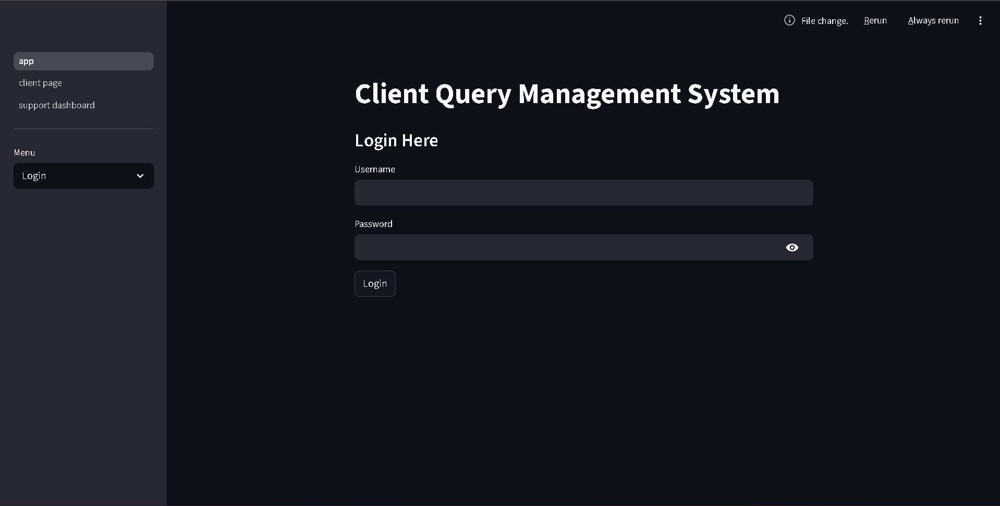
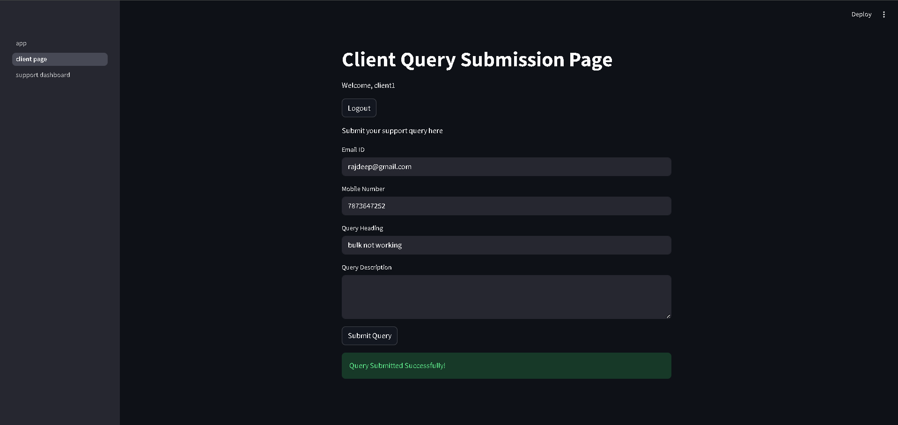
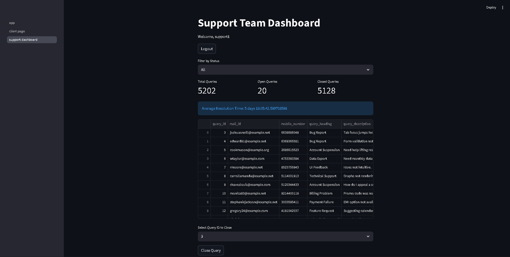

# 📌 Client Query Management System

A full-stack support ticket management system built using **Python, Streamlit, MySQL, and Pandas**.

This project allows clients to submit support queries while enabling support teams to track, manage, filter, and resolve tickets efficiently through a real-time dashboard.

---

# 🚀 Features

## 👤 Authentication System
- User Registration
- Secure Login
- Role-Based Access Control
- Logout Functionality

## 🧑‍💻 Client Module
- Submit support queries
- Enter email, mobile number, issue heading, and description
- Query stored directly into MySQL database

## 🛠️ Support Dashboard
- View all client queries
- Filter queries by status
- Close support tickets
- Automatically store query closing time
- Real-time dashboard updates

## 📊 Analytics & Metrics
- Total Queries
- Open Queries
- Closed Queries
- Average Resolution Time

## 📂 Dataset Integration
- CSV dataset provided by GUVI
- Loaded into MySQL using Pandas
- Realistic support ticket simulation

---

# 🏗️ Tech Stack

| Technology | Purpose |
|---|---|
| Python | Backend Logic |
| Streamlit | Frontend UI |
| MySQL | Database |
| Pandas | CSV Processing & Analytics |
| mysql-connector-python | Database Connectivity |

---

# 📁 Project Structure

```bash
client_query_management/
│
├── app.py
├── db.py
├── load_csv_to_mysql.py
├── query_data.csv
├── requirements.txt
├── README.md
│
├── pages/
│   ├── client_page.py
│   └── support_dashboard.py
│
├── utils/
│   └── auth.py
│
└── sql/
    └── schema.sql
```

---

# ⚙️ Installation & Setup

## 1️⃣ Clone Repository

```bash
git clone https://github.com/rajdeepsen97/client_query_management.git
```

---

## 2️⃣ Install Dependencies

```bash
pip install -r requirements.txt
```

---

## 3️⃣ Setup MySQL Database

Open MySQL Workbench and run:

```sql
CREATE DATABASE client_query_system;
```

Then execute the SQL schema from:

```bash
sql/schema.sql
```

---

## 4️⃣ Load Dataset

Run:

```bash
python load_csv_to_mysql.py
```

---

## 5️⃣ Run Streamlit Application

```bash
python -m streamlit run app.py
```

---

# 🔐 Login Roles

## 👤 Client
Can:
- Submit queries

Cannot:
- Access support dashboard

---

## 🛠️ Support
Can:
- View all queries
- Filter tickets
- Close tickets
- View analytics

---

# 📈 Dashboard Metrics

The dashboard provides:
- Total ticket count
- Open ticket count
- Closed ticket count
- Average query resolution time

---

# 🧠 Key Concepts Used

- CRUD Operations
- Authentication & Authorization
- Session Management
- Role-Based Access Control
- CSV Data Processing
- Database Connectivity
- Dashboard Analytics
- Real-Time Query Management

---

# 📸 Screenshots

## Login Page


## Client Query Submission


## Support Dashboard


---

# 🎯 Future Improvements

- Email notifications
- Ticket priority system
- Query search functionality
- Charts & visual analytics
- Export reports to CSV/PDF
- Admin dashboard

---

# 👨‍💻 Author

**Rajdeep Sen**

Built as part of the **GUVI Full Stack Development Project**.

---